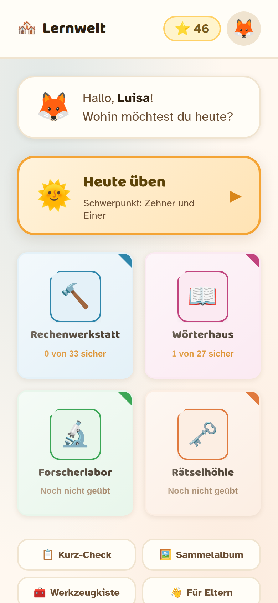
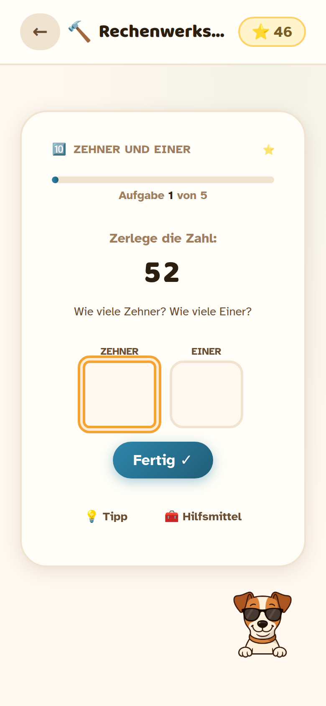
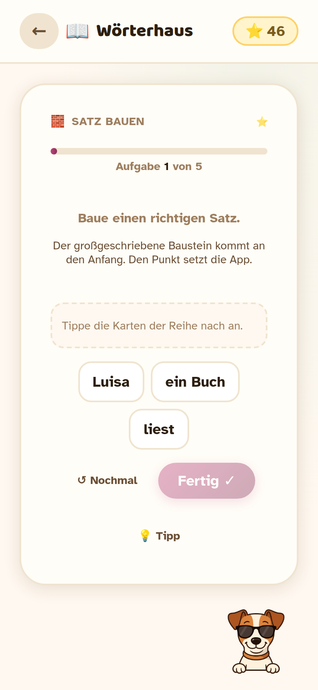
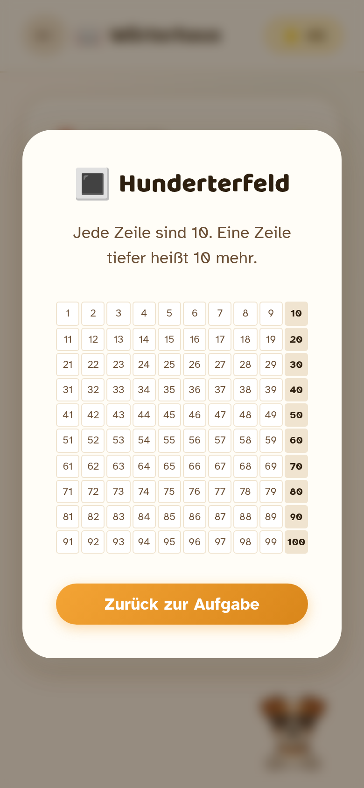
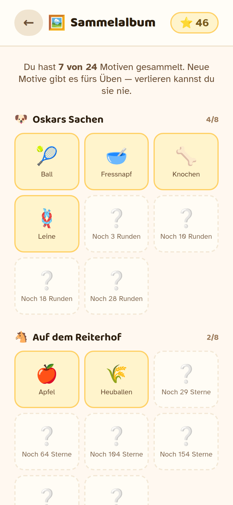
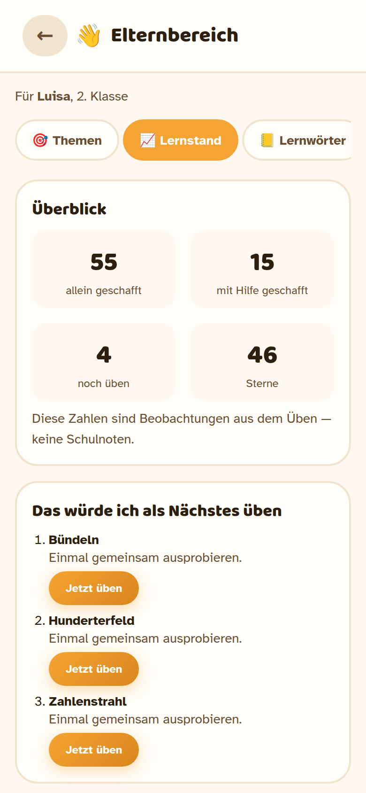

# 🏘️ Lernwelten

Eine Lern-App für die Volksschule. Kinder erkunden ein kleines Dorf mit vier
Lerngebäuden und üben dort Mathematik, Deutsch, Sachwissen und logisches
Denken — begleitet vom Maskottchen Oskar.

Kostenlos, werbefrei, ohne Anmeldung. Läuft im Browser, auch offline.
Der Lernstand bleibt auf dem Gerät.

---

## Für wen

Gedacht für die 1. und 2. Klasse Volksschule in Österreich. Die Inhalte der
2. Klasse orientieren sich an den Lernzielen von *Zahlenreise 2* und
*Flex und Flora 2* — mit eigenen Aufgaben, nicht mit Buchseiten.

Sprache und Begriffe sind österreichisch: **Jänner**, Bub, Turnsaal,
Namenwort, Zeitwort, Eigenschaftswort.

---

## Die vier Lernwelten

| | |
|---|---|
| 🔨 **Rechenwerkstatt** | Zehner und Einer, Hunderterfeld, Zahlenstrahl, Plus und Minus mit und ohne Zehnerübergang, Ergänzen auf 100, Malreihen, Teilen, Rechenmauern, Geld, Uhr, Längen, Gewichte, Formen und Diagramme |
| 📖 **Wörterhaus** | ABC ordnen, Namenwörter und Begleiter, Einzahl/Mehrzahl, zusammengesetzte Wörter, Zeitwörter, Eigenschaftswörter, Satzzeichen, Satzbau, Silben, St/Sp, Umlaute, ie, doppelte Mitlaute, Verlängern, Fehler verbessern, Merkwörter, Lesen |
| 🔬 **Forscherlabor** | Wissensquiz, Wahr oder falsch, Zuordnen |
| 🗝️ **Rätselhöhle** | Zahlen- und Formenmuster, „Was passt nicht?", Gedächtnis, Zahlen-Quadrat, Spiegelatelier |

Dazu kommen **Oskars Laden** (Geld, Rückgeld), **Oskars Werkzeugkiste**
(Zahlenstrahl, Hunderterfeld, Einmaleins-Tafel, Münzen, Uhr, Silbenhilfe,
ABC) und ein **Sammelalbum**.

---

## So läuft eine Runde

Eine Runde hat **5 oder 10 Aufgaben** — mehr nicht. Kein Zeitdruck, keine
Rangliste.

Jede Aufgabe endet in genau einem von drei Zuständen:

- **allein geschafft** — erster Versuch richtig, ohne Hilfe
- **mit Hilfe geschafft** — nach einem Tipp oder einer Korrektur
- **noch üben** — die Lösung wurde gezeigt; die Aufgabe kommt später wieder

Tipps kommen **schrittweise**: erst ein Denkanstoß, dann ein Zwischenschritt,
zuletzt der Rechenweg. Erst nach drei Fehlversuchen zeigt die App die Lösung.

Die Schwierigkeit passt sich an — aber vorsichtig: frühestens nach zwei
Runden auf derselben Stufe und höchstens um eine Stufe. Gewertet werden nur
die selbstständigen Erstversuche.

---

## So sieht das aus

| Dorfplatz | Aufgabe | Satz bauen |
|---|---|---|
|  |  |  |

| Werkzeugkiste | Sammelalbum | Elternbereich |
|---|---|---|
|  |  |  |

Die Bilder entstehen mit `node tests/screenshots-run.js` direkt aus der App
im iPhone-Hochformat — sie zeigen immer den aktuellen Stand.

---

## „Heute üben"

Auf dem Dorfplatz gibt es einen großen Knopf **„Heute üben"**. Er startet
eine kurze Runde, die das aktuelle Thema mit fälligen Wiederholungen mischt.

Erwachsene legen im **Elternbereich** fest, welche Themen freigegeben sind
und was gerade Schwerpunkt ist. So bekommt ein Kind im September nicht schon
den Stoff vom Juni.

---

## Elternbereich

Erreichbar über das Profilbild → *Elternbereich* (durch eine kleine
Rechenfrage geschützt, damit er nicht versehentlich geöffnet wird).

- **Themen** — einzeln freigeben, Schwerpunkt setzen, Rundenlänge wählen.
  Dazu eine Suche „Buchseite nachschlagen": Seite eingeben, zugeordnetes
  Lernziel sehen. Gibt es keine gesicherte Zuordnung, sagt die App das
  ausdrücklich — sie rät nicht.
- **Lernstand** — pro Lernziel: allein / mit Hilfe / noch üben, letzte
  Übung, Stufe und ein konkreter nächster Vorschlag. Keine Schulnoten,
  sondern Beobachtungen.
- **Lernwörter** — fünf bis zehn Wörter der Woche eintragen. Geübt wird
  mit der geprüften Form *ansehen – verdecken – schreiben*. Lücken- oder
  Silbenaufgaben werden für eigene Wörter bewusst **nicht** automatisch
  erzeugt, weil jedes Wort dafür einzeln geprüft werden müsste.
- **Daten** — Sicherung herunterladen und wieder einspielen. Wichtig vor
  einem Gerätewechsel: Der Lernstand liegt nur in diesem Browser.
- **Profile** — mehrere Kinder, wechseln, umbenennen, löschen.

Zusätzlich lassen sich **Arbeitsblätter** zum Ausdrucken erzeugen — mit einer
eigenen Lösungsseite zum Abtrennen.

---

## Kurz-Check

Ein Kurz-Check stellt Aufgaben zu einer festgelegten Themenmischung:
ein Versuch je Aufgabe, keine Tipps während der Runde, **keine**
Stufenänderung. Am Ende steht, was pro Lernziel allein gelungen ist.

Das ist ein Hinweis, keine Diagnose und schon gar keine Note. Ein einzelner
Check sagt weniger aus als mehrere Beobachtungen an verschiedenen Tagen.

---

## Datenschutz

- Kein Konto, keine Anmeldung, kein Server.
- Der Lernstand liegt ausschließlich im `localStorage` des Browsers.
- **Keine externen Dienste.** Die Schriften liegen lokal im Projekt
  (SIL Open Font License, siehe `assets/fonts/README.md`). Es gibt keine
  Analysefunktion und keine Verbindung zu Google Fonts.
  `tests/offline.test.js` prüft das automatisch bei jedem Testlauf.
- Weil `localStorage` an die Adresse der Seite gebunden ist, gehen Daten bei
  einem Domainwechsel verloren, wenn vorher keine Sicherung gemacht wurde.

---

## Zugänglichkeit

- Zoom ist erlaubt (kein `user-scalable=no`).
- Große Touchflächen, beschriftete Eingabefelder.
- Rückmeldungen werden über eine `aria-live`-Region angesagt.
- Dialoge haben Fokusverwaltung, Escape und eine Fokusfalle.
- Tastaturbedienung durchgehend möglich.
- „Weniger Bewegung" im Elternbereich, zusätzlich wird
  `prefers-reduced-motion` beachtet.
- Als Fließschrift kommt *Atkinson Hyperlegible* zum Einsatz — entworfen für
  gute Unterscheidbarkeit ähnlicher Buchstaben.

---

## Selbst ausprobieren

Kein Build nötig:

```bash
git clone https://github.com/buildwithyr/lernwelten.git
cd lernwelten
npm start          # startet python3 -m http.server 8080
```

Dann `http://localhost:8080` öffnen. Ein echter Server ist nötig, damit der
Service Worker funktioniert — `index.html` per Doppelklick reicht dafür nicht.

### Tests

```bash
npm test                        # 215 Modultests, kein Browser nötig
npm run test:browser            # 30 Prüfungen in Chromium
node tests/walkthrough-run.js   # jede Übung im Browser durchspielen
```

Die einzige Abhängigkeit ist Playwright, und die braucht nur der Testlauf.
Die App selbst hat keine.

---

## Weiterentwickeln

`CLAUDE.md` beschreibt Architektur, Datenmodell, Migration und die Regeln für
neue Aufgaben. `ARBEITSSTAND.md` hält fest, was erledigt ist und was ansteht.

---

## Lizenz

Für den Code ist bisher keine Lizenz vergeben — bei Interesse an Nutzung oder
Weiterentwicklung gerne über Issues melden.

Die enthaltenen Schriften stehen unter der SIL Open Font License 1.1, siehe
`assets/fonts/`.
