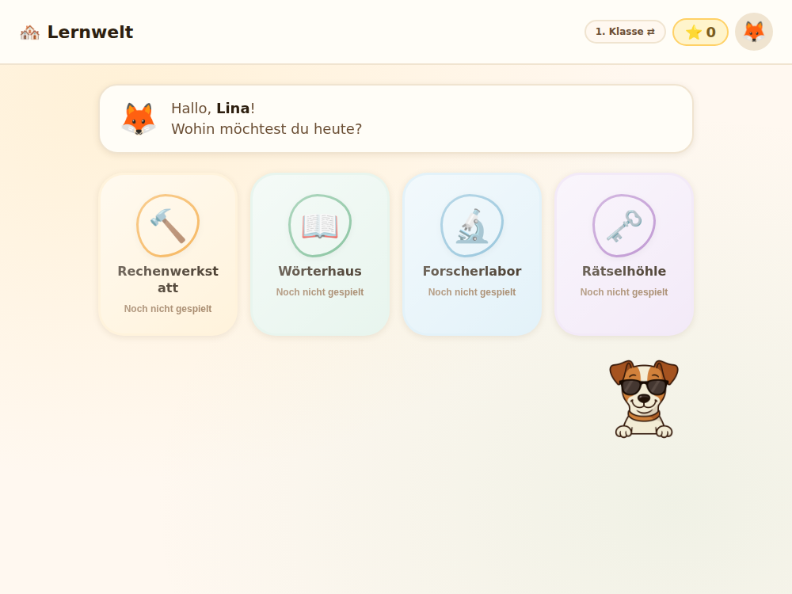
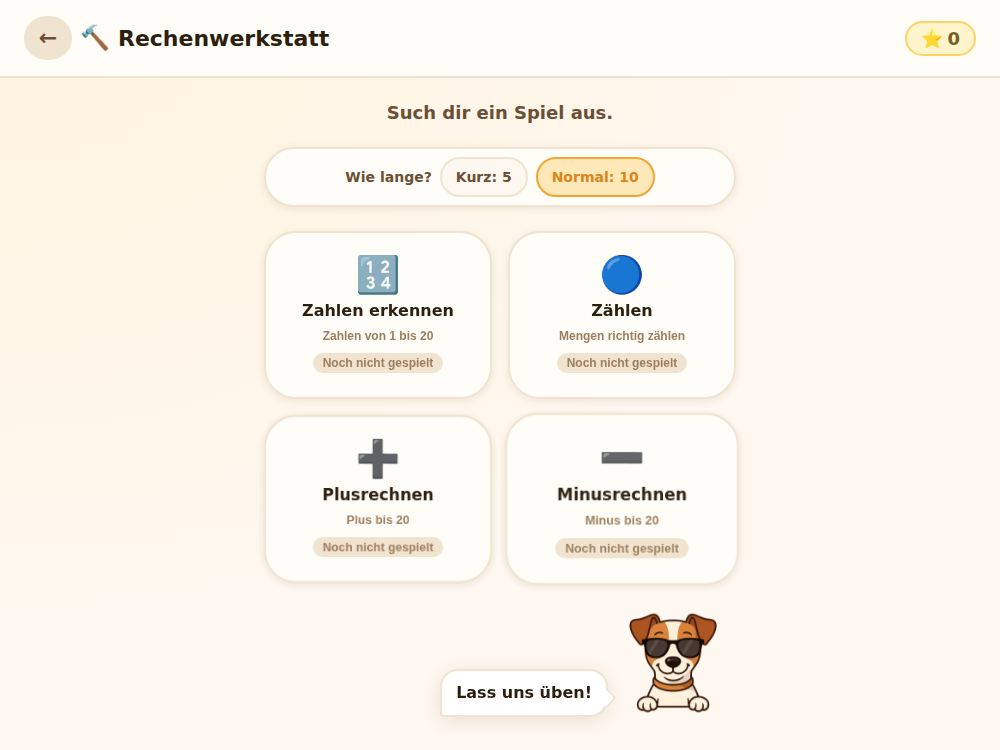
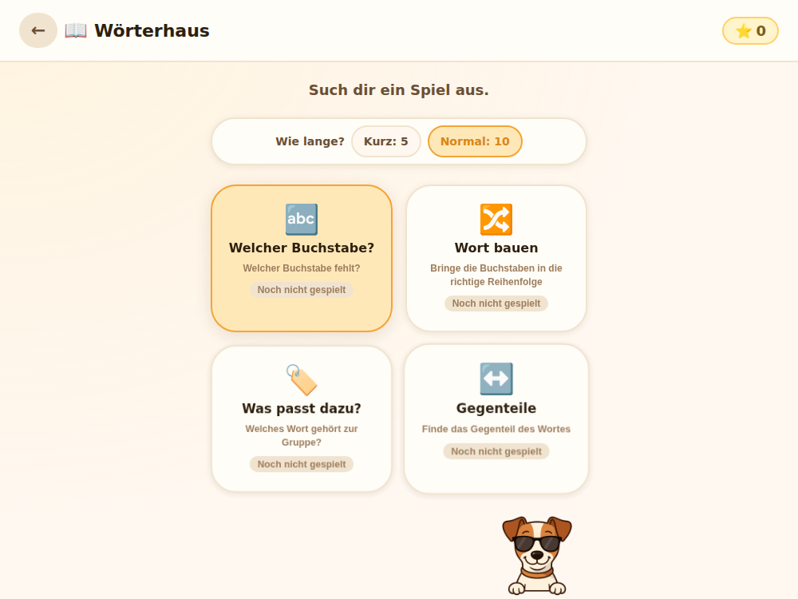
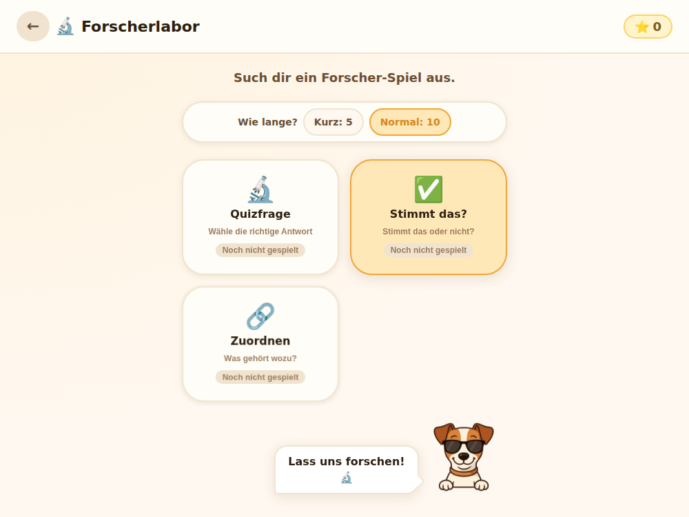
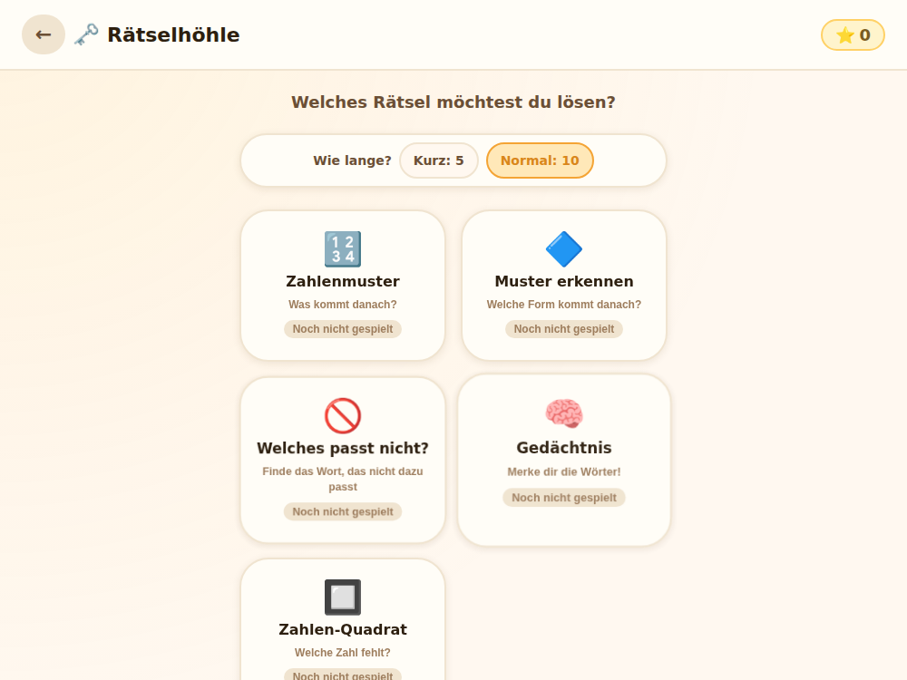

# 🏘️ Lernwelten

Eine spielerische Lern-App für Kinder der 1. und 2. Klasse Volksschule. Kinder erkunden ein kleines Dorf mit vier Lerngebäuden und üben dabei Mathe, Lesen, Sachwissen und logisches Denken — begleitet vom Maskottchen Oskar (1. Klasse) bzw. Samson (2. Klasse).

Kostenlos, werbefrei, ohne Anmeldung. Läuft direkt im Browser, auch offline (installierbar als App).

## 📚 Die vier Lernwelten

| | |
|---|---|
| 🔨 **Rechenwerkstatt** | Zahlen erkennen, zählen, plus- und minusrechnen (Klasse 2: auch Uhr lesen, Textaufgaben, Euro & Cent) |
| 📖 **Wörterhaus** | Fehlende Buchstaben ergänzen, Wörter bauen, Wortgruppen und Gegenteile finden |
| 🔬 **Forscherlabor** | Wissensquiz, Wahr-oder-falsch-Fragen, Zuordnungsaufgaben zu Alltagsthemen |
| 🗝️ **Rätselhöhle** | Zahlen- und Formenmuster, "Was passt nicht dazu?", Gedächtnisspiel, Mini-Sudoku |

Der Schwierigkeitsgrad passt sich automatisch an: Läuft es gut, werden die Aufgaben etwas schwerer; bei Unsicherheit wieder leichter. Für jede richtig gelöste Aufgabenrunde gibt's Sterne, die zu neuen Levels führen.

## 🖼️ Screenshots

**Dorfplatz** — Ausgangspunkt, hier wählt das Kind sein Lerngebäude:



**Rechenwerkstatt**



**Wörterhaus**



**Forscherlabor**



**Rätselhöhle**



## 🔗 Live-Demo

👉 **[lernwelten.vercel.app](https://lernwelten.vercel.app/)**

## 🧩 Technik

Bewusst einfach gehalten, damit jeder mit ein bisschen HTML/CSS/JS-Grundwissen mitentwickeln kann:

- **Vanilla JavaScript, HTML, CSS** — keine Frameworks, kein Build-Prozess
- Läuft komplett im Browser, keine Server-Anbindung, keine Datenübertragung nach außen
- Fortschritt wird lokal im Browser gespeichert (`localStorage`) — bleibt auf dem jeweiligen Gerät
- PWA-fähig: über den Browser installierbar, danach auch offline nutzbar

## 🚀 Selbst ausprobieren oder weiterentwickeln

Kein `npm install`, kein Build nötig — einfach klonen und öffnen:

```bash
git clone https://github.com/buildwithyr/lernwelten.git
cd lernwelten
```

Danach `index.html` direkt im Browser öffnen, oder für volle Funktionalität (z. B. den Service Worker) einen einfachen lokalen Server starten:

```bash
python3 -m http.server 8080
```

und im Browser `http://localhost:8080` aufrufen.

Wer ein neues Lernfach ergänzen möchte, findet die Kurzanleitung dazu oben in `app.js` bzw. in `CLAUDE.md`.

## 📄 Lizenz

Bisher keine Lizenz vergeben — bei Interesse an Nutzung oder Weiterentwicklung gerne über Issues melden.
